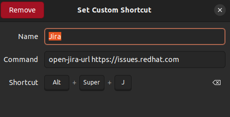
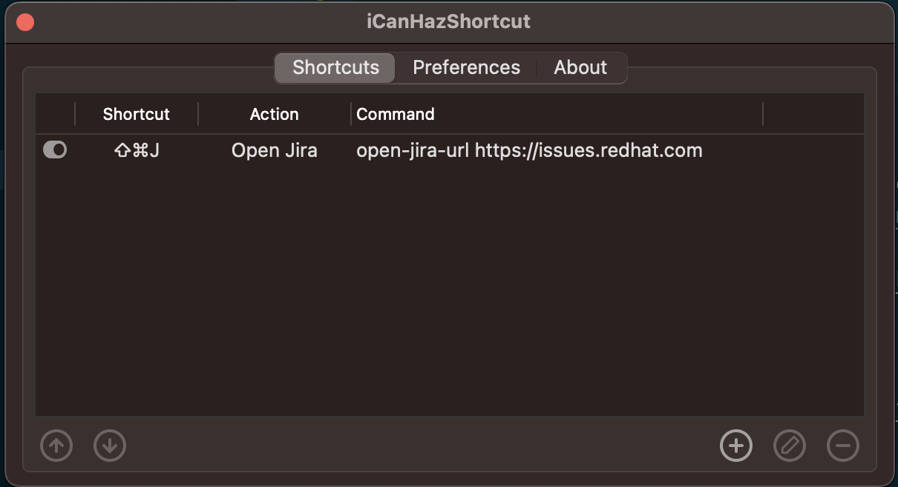
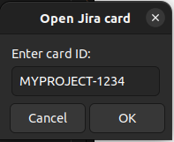

# open-jira-url
Quick shortcut to open a jira card referenced by text only

## Install

```
go install github.com/NautiluX/open-jira-url
```

Create a keyboard shortcut.

### GNOME

Using GNOME, do so by navigating to `Settings > Keyboard > View and Customize Shortcuts > Custom Shortcuts > +`.
Set a shortcut to run open-jira-url.
The shortcut should run the binary with the Jira URL as parameter, e.g. `open-jira-url https://issues.redhat.com`



### MacOS

On MacOS, you can use [iCanHazShortcut](https://github.com/deseven/iCanHazShortcut) to set up a shortcut.

```
brew install icanhazshortcut
```

Run the application and add your shortcut, e.g. `open-jira-url https://issues.redhat.com`



## Build from source

Clone repository and run

```
$ make install
```

Make sure the binary is executable by whatever executes the keyboard shortcut.
E.g. you may need to link it to /usr/bin when using GNOME 3.


## Usage

Press your configured hot-key and enter the Jira card ID.
Press Enter to open it in your web browser.


